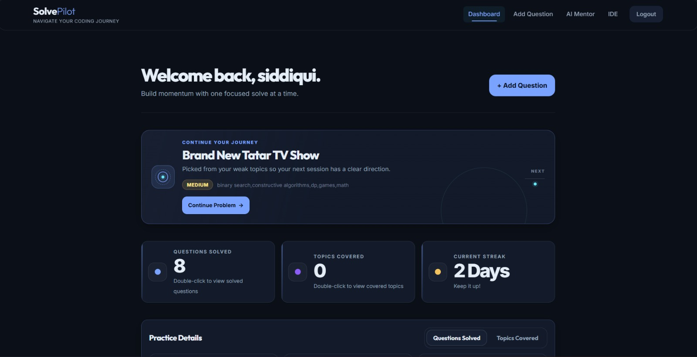
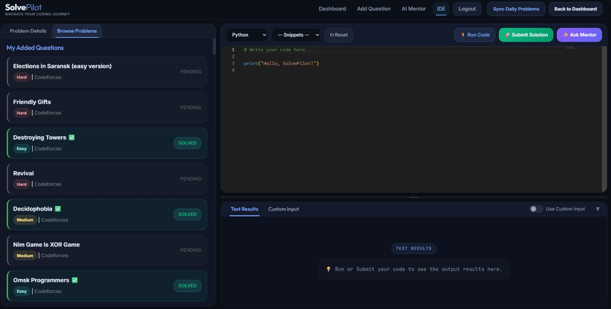
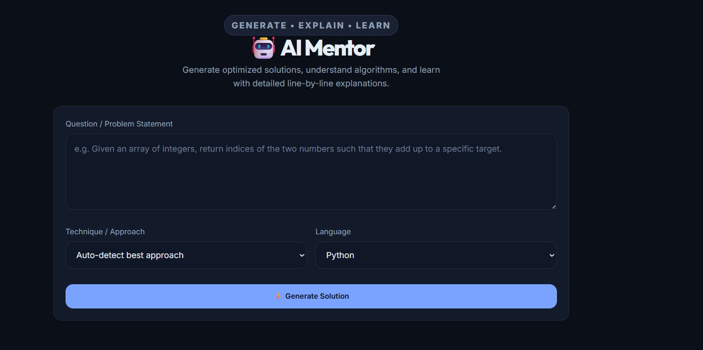
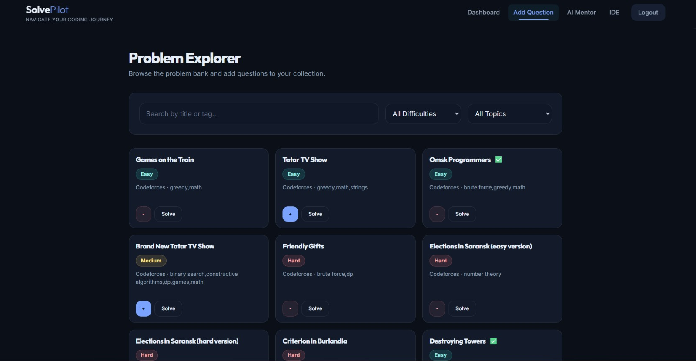

<div align="center">
  <h1>🧠 SolvePilot</h1>
  <p><strong>AI-Powered Coding Practice Platform</strong></p>
  <p>Solve problems, get intelligent feedback, and track your growth — all from your browser.</p>

  <!-- Badges -->
  <p>
    
    
    
    
    
  </p>

  <br>

  <p><strong>📖 <a href="#highlights">Features</a> &nbsp;·&nbsp; 🚀 <a href="#quick-start">Quick Start</a></strong></p>

  <br>

  <!-- Screenshot previews -->
  <table>
    <tr>
      <td align="center"><br><sub>Dashboard</sub></td>
      <td align="center"><br><sub>Online IDE</sub></td>
    </tr>
    <tr>
      <td align="center"><br><sub>AI Problem Solver</sub></td>
      <td align="center"><br><sub>Problem Explorer</sub></td>
    </tr>
  </table>
</div>

---

## 💡 Why SolvePilot?

Most coding platforms make you switch between an editor, a search engine, and a debugger. SolvePilot brings everything into one place.

| Problem | How SolvePilot Solves It |
|---|---|
| **Stuck on a bug?** | AI Mentor reads your code, explains the error, and gives a hint — not the answer. |
| **Don't know where to start?** | AI Problem Solver breaks down any problem statement into a step-by-step plan with code. |
| **No local setup?** | Full Monaco Editor in the browser with remote execution — zero configuration. |
| **Forgetting what you learned?** | Dashboard tracks streaks, topic mastery, and daily challenges so you stay consistent. |
| **No good practice problems?** | Browse and sync 100+ curated Codeforces problems by difficulty and topic. |

Built for students, self-taught developers, and anyone preparing for technical interviews.

---

## ✨ Highlights

| | |
|---|---|
| 🎯 **Online IDE with Monaco Editor** | Full-featured code editor with syntax highlighting for Python, Java, C++, and JavaScript |
| 🤖 **AI Mentor** | Get structured code reviews, error explanations, optimization suggestions, and edge case analysis via Groq AI |
| 🧩 **AI Problem Solver** | Submit a problem statement — receive a classified solution with complexity analysis and line-by-line explanation |
| 💻 **Multi-language Execution** | Run code remotely via the Wandbox API (Python, Java, C++, JavaScript) |
| 📊 **Personal Dashboard** | Track streaks, weekly progress, topic mastery, daily challenges, and problem bank stats |
| 🔗 **Codeforces Integration** | Sync, browse, and save Codeforces problems to your personal collection |
| 🛡️ **Security-first** | CSRF protection on all POST routes, password hashing, rate limiting, XSS sanitization, parameterized SQL queries |

---

## 🛠 Tech Stack

| Frontend | Backend | Database | AI & APIs |
|---|---|---|---|
| Monaco Editor | Python 3 / Flask 3.1 | MySQL 8+ | Groq API (code review) |
| marked.js / MathJax | Flask-Limiter | mysql-connector-python | Wandbox (execution) |
| highlight.js / Chart.js | Blueprint architecture | — | Codeforces API (problems) |
| DOMPurify | Provider pattern (AI) | — | — |

---

## 🏗 Architecture

```
Browser (Monaco IDE)  ────▶  Flask App (Blueprints)  ────▶  MySQL Database
                                    │
                              ┌─────┴─────┐
                              │ AI Service │──▶ Groq API
                              │ (Groq/Dummy)│
                              └───────────┘
                                    │
                              ┌─────┴─────┐
                              │  Wandbox   │──▶ Remote execution
                              └───────────┘
```

The app is organized into **feature-scoped Flask blueprints** (`routes/`). AI logic is abstracted behind a provider pattern (`services/`) supporting both Groq and a dummy fallback.

---

## 🚀 Quick Start

### Prerequisites
- Python 3.10+, MySQL 8+, [Groq API key](https://console.groq.com) (free tier)

```bash
# 1. Clone & enter
git clone https://github.com/yourusername/solvepilot.git && cd solvepilot

# 2. Virtual environment
python -m venv venv && source venv/bin/activate   # macOS/Linux
venv\Scripts\activate                               # Windows

# 3. Install
pip install -r requirements.txt

# 4. Database
mysql -u root -p < schema.sql

# 5. Configure .env (see below)

# 6. Run
python app.py
```

Visit `http://localhost:5000`.

### Environment Variables

| Variable | Required | Default | Description |
|---|---|---|---|
| `GROQ_API_KEY` | ✅ | — | Groq API key for AI features |
| `SECRET_KEY` | ✅ | — | Flask session signing key (use `secrets.token_hex(32)`) |
| `DB_PASSWORD` | ✅ | — | MySQL password |
| `FLASK_DEBUG` | — | `0` | Set to `1` for debug mode |
| `FLASK_ENV` | — | — | Set to `production` for secure cookies |
| `AI_PROVIDER` | — | `groq` | `groq` or `dummy` (testing) |

> **Security note:** Generate a strong `SECRET_KEY` with `python -c "import secrets; print(secrets.token_hex(32))"`.

---

## 🛡 Security

| Measure | Implementation |
|---|---|
| **Password hashing** | Werkzeug `generate_password_hash` (pbkdf2:sha256) |
| **CSRF protection** | Per-session tokens validated on all `POST` routes (form + JSON) |
| **Rate limiting** | Login/signup: 5 req/min via Flask-Limiter |
| **Session cookies** | `HttpOnly`, `SameSite=Lax`, `Secure` in production |
| **XSS prevention** | DOMPurify sanitizes all AI-generated content before DOM insertion |
| **Error handling** | Custom 404/403/500/429 pages — no stack trace leakage |
| **SQL injection** | All queries use parameterized statements |

---

## 🚢 Production Deployment

```bash
pip install waitress
waitress-serve --host=0.0.0.0 --port=5000 app:app
```

**Checklist:**
- [ ] Set `FLASK_ENV=production`
- [ ] Generate a strong `SECRET_KEY`
- [ ] Disable debug mode (`FLASK_DEBUG=0`)
- [ ] Run behind a reverse proxy (Nginx, Caddy) with HTTPS
- [ ] Configure MySQL connection pooling for production loads

---

## 📂 Project Structure

```
SolvePilot/
├── app.py                  # Application factory & error handlers
├── config.py               # Env-based configuration
├── extensions.py           # Shared: DB, rate limiter, CSRF, AI client
├── requirements.txt        # Pinned dependencies
├── schema.sql              # Database schema (4 tables)
│
├── routes/                 # Feature-scoped Flask blueprints
│   ├── auth.py             # Login, signup, logout
│   ├── dashboard.py        # Stats, streaks, recommendations
│   ├── problems.py         # Codeforces sync, IDE page
│   ├── execute.py          # Wandbox code execution
│   ├── submit.py           # Solution judging + AI evaluation
│   ├── ai.py               # AI chat & mentor feedback
│   ├── collection.py       # User problem collection CRUD
│   ├── solve.py            # AI problem solver
│   └── questions.py        # Custom questions & problem explorer
│
├── services/               # AI provider abstraction
│   ├── ai_service.py       # GroqProvider / DummyProvider
│   └── prompt_builder.py   # Centralized AI prompt templates
│
├── templates/              # Jinja2 templates
├── static/                 # CSS, JS
│   └── js/ide.js           # Monaco Editor client logic
```

---

## 🔮 Roadmap

- Connection pooling for MySQL
- Pagination for problem browser
- OAuth login (GitHub, Google)
- Additional languages (Go, Rust, Ruby)
- Unit & integration tests
- Admin panel

---

## 📄 License

MIT — see `LICENSE`.

## 🙌 Acknowledgements

[Monaco Editor](https://microsoft.github.io/monaco-editor/) · [Wandbox](https://wandbox.org/) · [Codeforces API](https://codeforces.com/apiHelp) · [Groq](https://groq.com/) · [marked.js](https://marked.js.org/) · [highlight.js](https://highlightjs.org/) · [MathJax](https://www.mathjax.org/) · [Chart.js](https://www.chartjs.org/) · [DOMPurify](https://github.com/cure53/DOMPurify)
